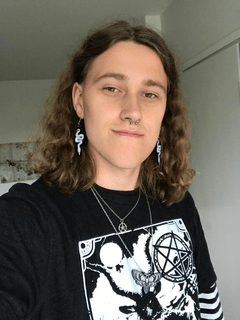

# About Me

## Hi, I'm Cass

I'm a computer engineering student at Oulu university of applied sciences. I love coding and on my free time I work on game development projects. I am already working on my personal web page/portfolio so I won't be updating this one. I only created this for an exercise.    

I am very much a nerd and here are some of my hobbies to prove it:
* Magic the Gathering
* Warhammer 40K
* DnD/Pathfinder
* Video Games
* Reading books and manga
